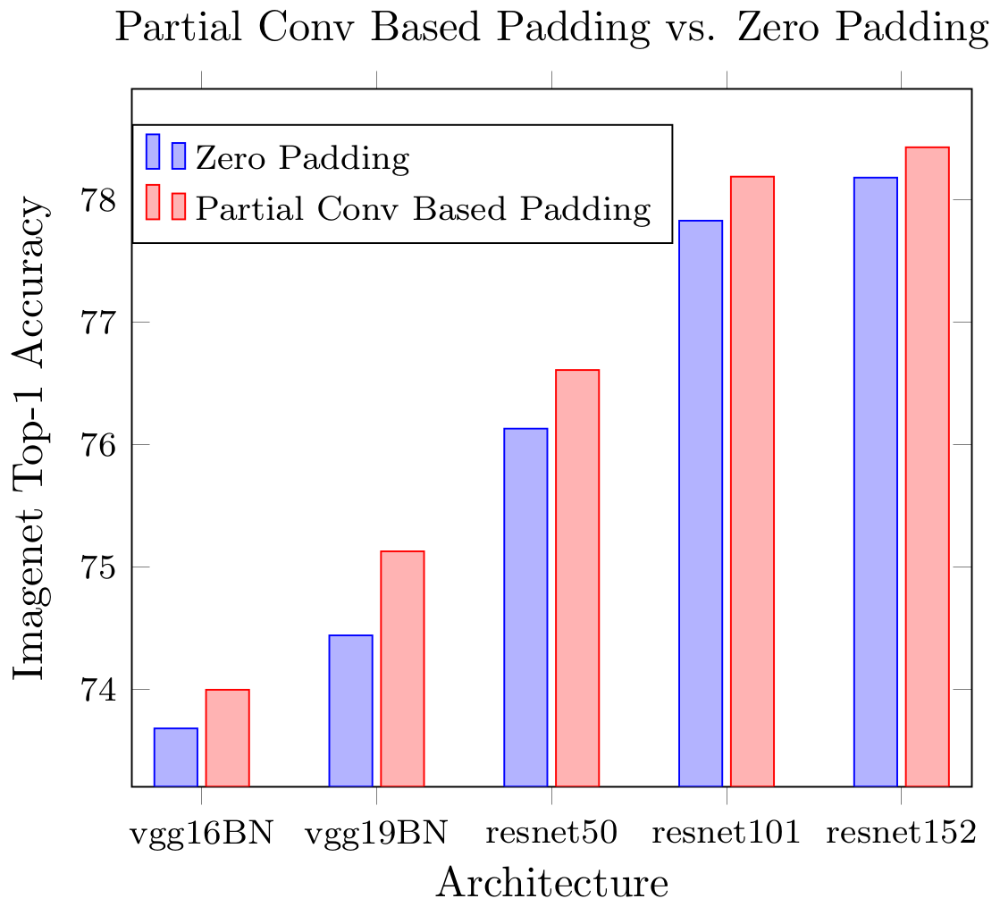
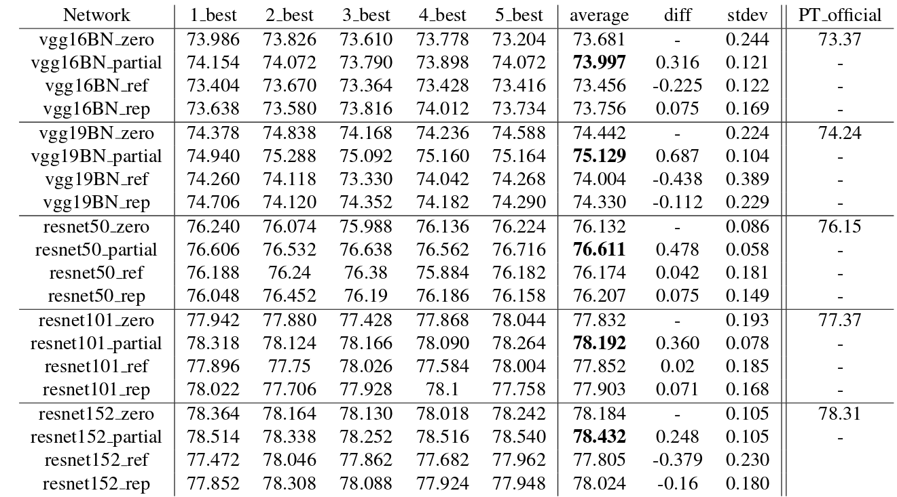

In this paper, we present a simple yet effective padding scheme that can be used as a drop-in module for existing convolutional neural networks. We call it partial convolution based padding, with the intuition that the padded region can be treated as holes and the original input as non-holes. Specifically, during the convolution operation, the convolution results are re-weighted near image borders based on the ratios between the padded area and the convolution sliding window area. Extensive experiments with various deep network models on ImageNet classification and semantic segmentation demonstrate that the proposed padding scheme consistently outperforms standard zero padding with better accuracy.

<!-- <iframe width="853" height="480" src="https://www.youtube.com/embed/gg0F5JjKmhA" frameborder="0" allow="accelerometer; autoplay; encrypted-media; gyroscope; picture-in-picture" allowfullscreen></iframe>
 -->

## Comparison with Zero Padding

  
  

## Comparison with Zero Padding, Reflection Padding and Replication Padding for 5 runs

  
  
<!--    -->

The best top-1 accuracies for each run with 1-crop testing. \*\_zero, \*\_pd, \*\_ref and \*\_rep indicate the corresponding model with zero padding, partial convolution based padding, reflection padding and replication padding respectively. \*\_best means the best validation score for each run of the training. Average represents the average accuracy of the 5 runs. Column diff represents the difference with corresponding network using zero padding. Column stdev represents the standard deviation of the accuracies from 5 runs. PT\_official represents the corresponding official accuracies published on PyTorch website: https://pytorch.org/docs/stable/torchvision/models.html

 
## Code
[https://github.com/NVIDIA/partialconv](https://github.com/NVIDIA/partialconv)

## Related 
[Image Inpainting for Irregular Holes Using Partial Convolutions](../publication/partialconv-inpainting)

<!-- <video width="640" height="480" controls>
  <source src="https://drive.google.com/uc?export=view&id=11_WDpit5ETTXwZx5g4LmnkB0elVdiXT4" type="video/mp4">Your browser does not support the video tag.
</video>
 -->

